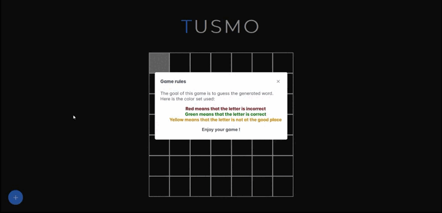

# Motus Game

<div align="center">
    
    
    
    
</div>

## Presentation

Welcome to the Motus Game repository, a comprehensive setup designed to launch a Motus game application with ease. This project is structured into two main components, each managed as a submodule: `MotusAPI` for the backend and `MotusIHM` for the frontend interface.  
The application utilizes Docker to simplify deployment, comprising three custom Docker containers for the Angular frontend, the Spring Boot backend, and the PostgreSQL database.
  
Note that the project only supports French for the moment. English is coming soon...

## Demonstration video

<p align="center">
  
</p>

## Prerequisites

Before you begin, ensure you have the following installed on your system:

- Docker
- Docker Compose
- Git

## Quick Start

To get your Motus game application running, follow these steps:

1. **Clone the Repository**

    Clone this repository and its submodules using the following command:

    ```bash
    git clone --recurse-submodules https://github.com/Naofel-eal/Motus
    ```

    If you don't want to manually rebuild the projects, you can just use the following command:  
     ```bash
    git clone https://github.com/Naofel-eal/Motus
    ```

    And if you've already cloned the repository without the submodules and you need it, you can fetch them by running:

    ```bash
    git submodule update --init --recursive
    ```

2. **Launch with Docker Compose**

    Navigate to the root of the Motus project where the `docker-compose.yml` file is located, and run the following command:

    ```bash
    docker-compose up
    ```

    This command will pull the necessary Docker images from Docker Hub and start the containers for the Angular frontend, Spring Boot backend, and PostgreSQL database.

3. **Access the Application**

    Once all containers are up and running, you can access the Motus game application by opening a web browser and navigating to:

    ```
    http://localhost
    ```

## Architecture Overview

- **Frontend (MotusIHM):** An Angular application providing the user interface for the Motus game.
- **Backend (MotusAPI):** A Spring Boot application responsible for game logic and data persistence. The backend development followed a Test-Driven Development (TDD) approach and is structured using Clean Architecture principles, ensuring high maintainability, scalability, and ease of testing.
- **Database:** A PostgreSQL database for storing application data.

## Docker Containers

The project uses three Docker containers, hosted on Docker Hub. The containers are defined as follows:

- **motus_ihm:** Contains the Angular application, pre-built and ready to serve.
- **motus_api:** Hosts the Spring Boot application, set up to connect with the PostgreSQL database.
- **motus_db:** A pre-configured PostgreSQL database container.

## Contributing

We welcome contributions to the Motus game project. Whether it's reporting a bug, discussing improvements, or contributing code, please feel free to reach out.
